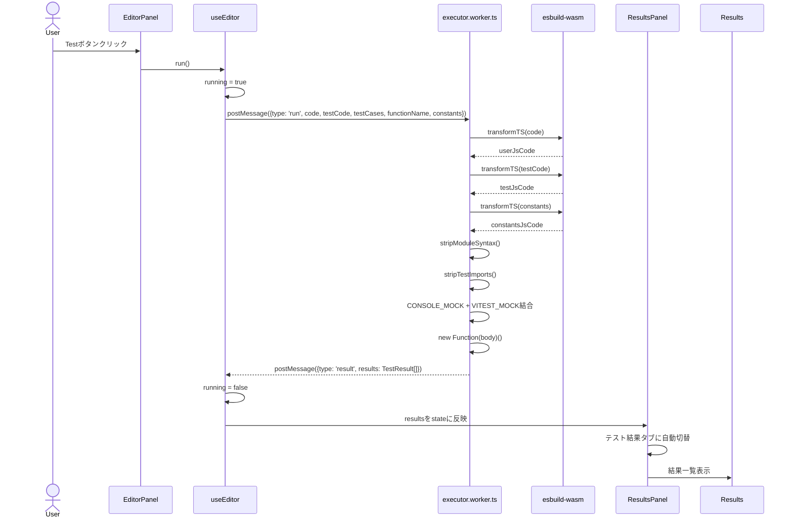
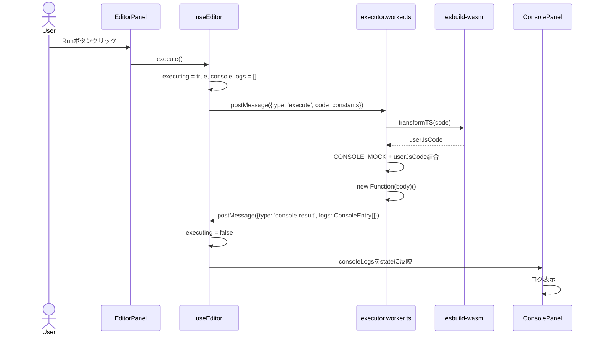
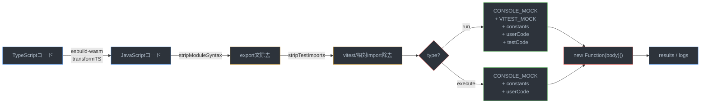

# 機能: ユーザーがコードを実装し、テストや実行ができる

## 概要

Monaco Editorでユーザーがコードを編集し、Testボタンでテストケースを実行、Runボタンでコードを単体実行できる機能。コードのトランスパイル・実行はWeb Worker内のesbuild-wasmで行われ、メインスレッドをブロックしない。

---

## データフロー全体図

### テスト実行フロー（Testボタン）



### コード実行フロー（Runボタン）



### Worker内のコード変換パイプライン



---

## 1. EditorPanel（モナコエディタ）

**ファイル:** `src/components/Editor/EditorPanel.tsx`

Monaco Editorを中心としたパネル。上部にタイトルとボタン、下部にConsolePanelを配置。

### 主要機能
- **Monaco Editor**: TypeScript言語モード、vs-darkテーマ
- **Testボタン**: テストケース実行（`run()`呼び出し）
- **Runボタン**: コード単体実行（`execute()`呼び出し）
- **定数の補完**: `problem.constants` がある場合、Monaco の `addExtraLib` で型補完を有効化

```typescript
// 定数の型補完を自動登録
useEffect(() => {
  if (problem.constants) {
    const ambientDecls = problem.constants.replace(
      /^const\s+(\w+)\s*=\s*('...'|"...")\s*;?/gm,
      'declare const $1: $2;'
    );
    libRef.current = monaco.typescript.typescriptDefaults.addExtraLib(
      ambientDecls, 'ts:problem-constants.d.ts'
    );
  }
}, [monaco, problem.constants]);
```

---

## 2. useEditor hook（状態管理・Worker通信）

**ファイル:** `src/components/Editor/hooks/useEditor.ts`

### 状態

| 状態 | 型 | 説明 |
|------|------|------|
| `code` | `string` | エディタのコード |
| `results` | `TestResult[]` | テスト実行結果 |
| `running` | `boolean` | テスト実行中フラグ |
| `consoleLogs` | `ConsoleEntry[]` | コンソール出力 |
| `executing` | `boolean` | コード実行中フラグ |

### Worker初期化

```typescript
useEffect(() => {
  workerRef.current = new Worker(
    new URL('../../../workers/executor.worker.ts', import.meta.url),
    { type: 'module' }
  );
  return () => { workerRef.current?.terminate(); };
}, []);
```

### コード保存（デバウンス付き）

```typescript
const setCode = (newCode: string) => {
  setCodeState(newCode);
  if (debounceRef.current) clearTimeout(debounceRef.current);
  debounceRef.current = setTimeout(() => {
    saveProblemCode(problem.id, newCode);
  }, 300);
};
```

### run()（テスト実行）

1. `running = true` に設定
2. Worker に `{ type: 'run', code, testCode, testCases, functionName, constants }` を送信
3. Worker から `{ type: 'result', results }` を受信
4. `results` を state に反映、`running = false`
5. エラー時: `{ type: 'error', message }` → 失敗結果として表示

### execute()（コード実行）

1. `executing = true`、`consoleLogs = []` に設定
2. Worker に `{ type: 'execute', code, constants }` を送信
3. Worker から `{ type: 'console-result', logs }` を受信
4. `consoleLogs` を state に反映、`executing = false`

---

## 3. executor.worker.ts（Web Worker）

**ファイル:** `src/workers/executor.worker.ts`

### esbuildサービス（src/services/esbuild.service.ts）

```typescript
import * as esbuild from 'esbuild-wasm/esm/browser.js';

async function transformTS(code: string): Promise<string> {
  await ensureInitialized();  // wasmURL で初期化（1回のみ）
  const result = await esbuild.transform(code, { loader: 'ts', target: 'es2020' });
  return result.code;
}
```

### コード前処理

| 関数 | 処理 |
|------|------|
| `stripModuleSyntax(code)` | `export { }`, `export const/let/var/function/class` → local宣言に変換 |
| `stripTestImports(code)` | `import ... from 'vitest'` / `'./execute'` / `'./testCases'` を除去 |

### テスト実行（type: 'run'）

実行コードは以下を結合して `new Function()` で実行:

```
CONSOLE_MOCK           ← console.log等をキャプチャ
VITEST_MOCK            ← describe/it/it.each/expect のモック実装
constantsJsCode        ← 定数（export除去済み）
userJsCode             ← ユーザーコード（export除去済み）
testCases              ← JSON.stringify
testCodeBody           ← テストコード（import除去済み）
return { results, logs }
```

**VITEST_MOCK の実装:**
- `describe(name, fn)`: fn() を実行
- `it(name, fn)`: try-catch で fn() 実行、結果を `__testResults` に push
- `it.each(cases)`: テストケース配列をイテレーション
- `expect(actual)`: `.toBe()`, `.toEqual()`, `.toMatchObject()`, `.toHaveLength()`, `.toBeGreaterThan()`, `.toThrow()` をサポート
- `__deepEqual()`: JSON.stringify ベースの深い比較

### コード実行（type: 'execute'）

```
CONSOLE_MOCK
constantsJsCode
userJsCode
return __consoleLogs
```

---

## 4. テスト結果表示（Results コンポーネント）

**ファイル:** `src/components/Results/Results.tsx`

### 表示内容

- **パス数表示**: `{passed} / {total} passed`
- **結果一覧**: アコーディオン形式で各テストケースを展開可能
  - PASS: 緑色ラベル
  - FAIL: 赤色ラベル
  - 展開時: Input, Expected, Actual, Error/Reason を monospace で表示
- **全テストPASS時**: `SubmissionArea` を表示（提出機能へ接続）
- **回答済みユーザー**: 「回答済み」テキストを表示、提出エリアは非表示

### タブ自動切替

`ResultsPanel` でテスト実行開始時に自動で「テスト結果」タブへ切替:

```typescript
useEffect(() => {
  if (running || results.length > 0) {
    setTab(RESULT_TAB);
  }
}, [problem.id, running, results]);
```

---

## 5. コンソールパネル（ConsolePanel）

**ファイル:** `src/components/Editor/ConsolePanel.tsx`

- `log`: テキストカラー（通常）
- `info`: 青色
- `warn`: 黄色
- `error`: 赤色
- Clearボタンで全ログ消去
- 高さ160px固定、スクロール対応

---

## 関連ファイル

| ファイル | 役割 |
|---------|------|
| `src/components/Editor/EditorPanel.tsx` | Monaco Editor UI |
| `src/components/Editor/ConsolePanel.tsx` | コンソール出力表示 |
| `src/components/Editor/hooks/useEditor.ts` | エディタ状態・Worker通信管理 |
| `src/components/Editor/types.ts` | EditorPanelProps型 |
| `src/workers/executor.worker.ts` | Web Worker（TS→JS変換・テスト/コード実行） |
| `src/services/esbuild.service.ts` | esbuild-wasm初期化・トランスパイル |
| `src/components/Results/Results.tsx` | テスト結果一覧表示 |
| `src/components/ResultsPanel/ResultsPanel.tsx` | 3タブパネル（自動タブ切替） |
| `src/types/index.ts` | RunMessage, ExecuteMessage, TestResult, WorkerRequest/Response等 |
| `src/services/storage.service.ts` | コード永続化（saveProblemCode/loadProblemCode） |
