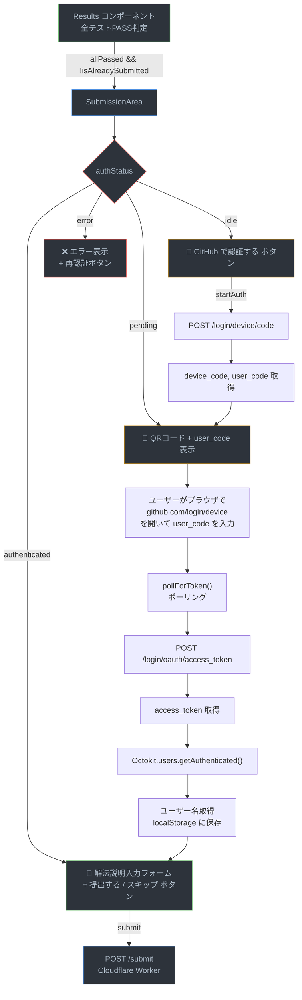
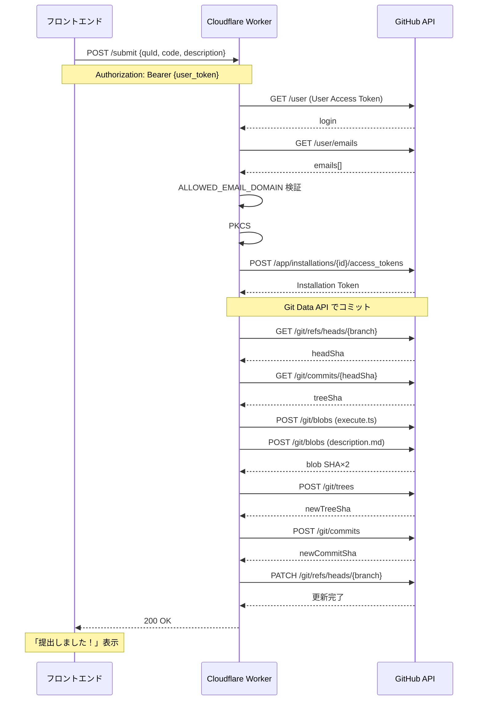
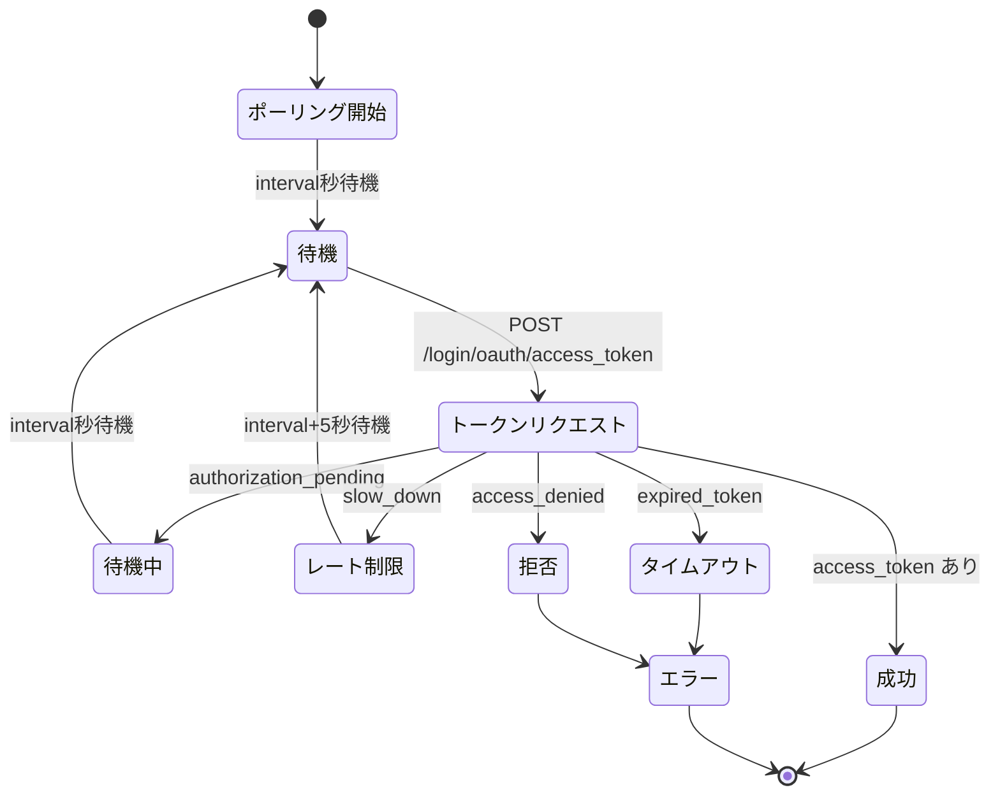

# 機能: テストを通ったコードをユーザーが提出できる

## 概要

全テストケースにPASSしたユーザーが、GitHub Device Flow認証を経て自分の回答コードと解法説明をGitHubリポジトリにコミットする機能。フロントエンドでDevice Flow認証を行い、Cloudflare Worker経由でGitHub App権限を使って回答をコミットする。

---

## データフロー全体図



### Cloudflare Worker 提出処理フロー



### Device Flow 認証ポーリング



---

## 1. 提出エリア表示条件（Results.tsx）

```typescript
const allPassed = results.length > 0 && results.every((r) => r.passed);

const isAlreadySubmitted = useMemo(() => {
  if (!githubUser) return false;
  return answers.some((a) => a.answerId === githubUser);
}, [answers, githubUser]);
```

- `allPassed === true` かつ `isAlreadySubmitted === false` の場合のみ `SubmissionArea` を表示
- 回答済みの場合は「回答済み」テキストのみ表示

---

## 2. GitHub Device Flow 認証（useGitHubSubmission.ts）

**ファイル:** `src/hooks/useGitHubSubmission.ts`

### 認証状態

```typescript
type AuthStatus = 'idle' | 'pending' | 'authenticated' | 'error';
```

### startAuth() の処理フロー

1. `authStatus` を `'pending'` に設定
2. `POST /login/device/code` を送信（CLIENT_ID + scope: `read:user,user:email`）
3. GitHub から `device_code`, `user_code`, `verification_uri`, `interval`, `expires_in` を取得
4. `deviceFlowData` に `{ verificationUri, userCode }` を設定 → UI表示
5. `pollForToken()` でアクセストークンをポーリング
6. トークン取得後、Octokit で `users.getAuthenticated()` を呼び出し
7. `saveGitHubToken(token)`, `saveGitHubUser(user.login)` で localStorage に保存
8. `authStatus` を `'authenticated'` に設定

### pollForToken() の仕組み

```typescript
async function pollForToken(deviceCode, interval, expiresIn): Promise<string> {
  const deadline = Date.now() + expiresIn * 1000;
  let currentInterval = interval;

  while (Date.now() < deadline) {
    await new Promise((r) => setTimeout(r, currentInterval * 1000));
    const data = await fetch(POST /login/oauth/access_token).json();

    if (data.access_token) return data.access_token;
    if (data.error === 'slow_down') { currentInterval += 5; continue; }
    if (data.error === 'authorization_pending') continue;
    if (data.error === 'expired_token') throw new Error('タイムアウト');
    if (data.error === 'access_denied') throw new Error('キャンセル');
  }
}
```

### OAuth プロキシ

- 開発時: Vite の `server.proxy` で `/github-oauth` → `https://github.com` にプロキシ
- 本番: `VITE_GITHUB_PROXY_URL`（Cloudflare Worker URL）を直接使用

---

## 3. SubmissionArea コンポーネント

**ファイル:** `src/components/Results/SubmissionArea.tsx`

### 状態別表示

| authStatus | 表示内容 |
|-----------|---------|
| `idle` | 「GitHub で認証する」ボタン（GitHubアイコン付き） |
| `pending` | user_code + 「GitHub で確認する」リンク + ローディング |
| `authenticated` | 解法説明テキストフィールド + 「提出する」「スキップ」ボタン |
| `error` | エラーメッセージ + 「再認証する」ボタン |
| submitSuccess | 「提出しました！」メッセージ |

### 提出処理

```typescript
<Button onClick={() => onSubmit(quId, code, description)}>
  提出する
</Button>
```

スキップボタン押下時は `SubmissionArea` が非表示になる。

---

## 4. submit() の処理（useGitHubSubmission.ts）

```typescript
const submit = async (quId, code, description) => {
  const token = loadGitHubToken();
  const res = await fetch(`${GITHUB_OAUTH_BASE}/submit`, {
    method: 'POST',
    headers: {
      'Content-Type': 'application/json',
      Authorization: `Bearer ${token}`,
    },
    body: JSON.stringify({ quId, code, description }),
  });
};
```

---

## 5. Cloudflare Worker（github-oauth-proxy.js）

**ファイル:** `cloudflare/github-oauth-proxy.js`

### POST /submit の処理フロー

1. **認証確認**: Authorization ヘッダーから User Access Token を取得
2. **ユーザー情報取得**: `GET /user` → login を取得
3. **メール検証**: `GET /user/emails` → ALLOWED_EMAIL_DOMAIN に一致するverifiedメールがあるか確認
4. **GitHub App JWT生成**: PKCS#8秘密鍵 + Web Crypto RS256 でJWT生成
5. **Installation Token取得**: `POST /app/installations/{id}/access_tokens`
6. **コミット実行**: `commitFiles()` で Git Data API を使用

### commitFiles() の処理

```
1. GET /git/refs/heads/{branch}      → headSha取得
2. GET /git/commits/{headSha}        → treeSha取得
3. POST /git/blobs                   → 各ファイルのblob作成
4. POST /git/trees                   → 新しいtree作成
5. POST /git/commits                 → コミット作成
6. PATCH /git/refs/heads/{branch}    → ref更新
```

### コミットされるファイル

```
answers/{quId}/{login}/
├── execute.ts       ← ユーザーが書いたコード
└── description.md   ← 解法説明
```

### CORS設定

```javascript
const ALLOWED_ORIGIN = 'https://sazanaminiki.github.io';
const CORS_HEADERS = {
  'Access-Control-Allow-Origin': ALLOWED_ORIGIN,
  'Access-Control-Allow-Methods': 'POST, OPTIONS',
  'Access-Control-Allow-Headers': 'Content-Type, Accept, Authorization',
};
```

---

## 6. GitHubAuthContext（認証状態の共有）

**ファイル:** `src/contexts/GitHubAuthContext.tsx`

```typescript
export function GitHubAuthProvider({ children }) {
  const auth = useGitHubSubmission();
  return <GitHubAuthContext.Provider value={auth}>{children}</GitHubAuthContext.Provider>;
}

export function useGitHubAuth() {
  const ctx = useContext(GitHubAuthContext);
  if (!ctx) throw new Error('useGitHubAuth must be used within GitHubAuthProvider');
  return ctx;
}
```

- `App.tsx` で `GitHubAuthProvider` をアプリ全体にProvide
- `SubmissionArea`, `HeaderBar`, `Results` 等で `useGitHubAuth()` を使用

---

## 7. GitHub Pages での回答配信

提出された回答は `add-answers` ブランチ経由でGitHub Pagesに配信される。

### deploy.yml の回答デプロイ

```yaml
- name: Generate answers-index.json
  run: |
    find answers -type f -name execute.ts | while read codefile; do
      # quId, answerId を抽出し、answers-index.json を生成
    done | jq -s . > answers/answers-index.json

- uses: peaceiris/actions-gh-pages@v3
  with:
    publish_dir: answers
    destination_dir: answers
    keep_files: true
```

---

## 関連ファイル

| ファイル | 役割 |
|---------|------|
| `src/components/Results/Results.tsx` | 全テストPASS判定 + 回答済み判定 |
| `src/components/Results/SubmissionArea.tsx` | 認証UI + 提出UI |
| `src/hooks/useGitHubSubmission.ts` | Device Flow認証 + submit() |
| `src/contexts/GitHubAuthContext.tsx` | 認証状態のContext Provider |
| `src/services/storage.service.ts` | token/user の localStorage 保存 |
| `cloudflare/github-oauth-proxy.js` | OAuth プロキシ + 提出バックエンド |
| `cloudflare/wrangler.toml` | Cloudflare Worker設定 |
| `.github/workflows/deploy.yml` | 回答のGitHub Pages配信 |
