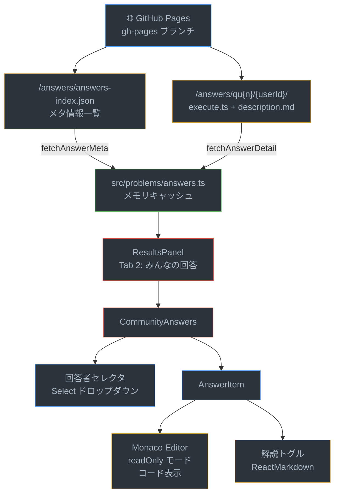
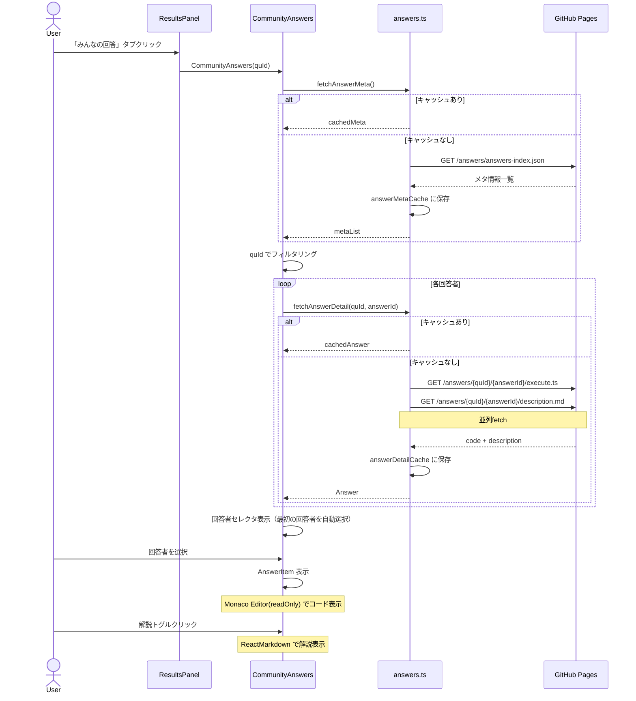
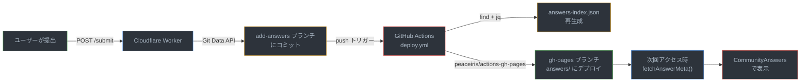

# 機能: 他の人の回答を選択し確認することができる

## 概要

「みんなの回答」タブで、問題ごとに他のユーザーが提出した回答コードと解説を閲覧できる機能。回答データはGitHub Pages上の静的ファイルとして配信され、フロントエンドから遅延fetch + キャッシュで取得される。

---

## データフロー全体図



### 回答データの取得・表示シーケンス



### 回答の追加からフロントエンド表示までのライフサイクル



---

## 1. 回答データの構造

### answers-index.json

```json
[
  {
    "quId": "qu1",
    "answerId": "bunchoNiki",
    "hasDescription": true
  }
]
```

### 回答ファイル

```
public/answers/
├── answers-index.json
└── qu1/
    └── bunchoNiki/
        ├── execute.ts        # 提出されたTypeScriptコード
        └── description.md    # 解法説明（Markdown）
```

---

## 2. 回答取得サービス（answers.ts）

**ファイル:** `src/problems/answers.ts`

### 型定義

```typescript
export interface Answer {
  answerId: string;     // GitHubユーザー名
  code: string;         // 回答コード（execute.tsの内容）
  description?: string; // 解法説明（description.mdの内容、なければundefined）
}
```

### fetchAnswerMeta()

```typescript
let answerMetaCache: Array<{ quId: string; answerId: string; hasDescription: boolean }> | null = null;

export async function fetchAnswerMeta() {
  if (answerMetaCache) return answerMetaCache;
  const res = await fetch(`${baseUrl}/answers/answers-index.json`);
  answerMetaCache = await res.json();
  return answerMetaCache;
}
```

- **キャッシュ**: 1回fetchしたらメモリに保持（ページリロードまで有効）
- **BASE_URL対応**: `import.meta.env.BASE_URL` からベースパスを取得

### fetchAnswerDetail()

```typescript
const answerDetailCache: Record<string, Answer> = {};

export async function fetchAnswerDetail(quId: string, answerId: string) {
  const key = `${quId}/${answerId}`;
  if (answerDetailCache[key]) return answerDetailCache[key];

  const [codeRes, descRes] = await Promise.all([
    fetch(`${baseUrl}/answers/${quId}/${answerId}/execute.ts`),
    fetch(`${baseUrl}/answers/${quId}/${answerId}/description.md`)
  ]);

  const code = await codeRes.text();
  let description = descRes.ok ? await descRes.text() : undefined;

  const answer = { answerId, code, description };
  answerDetailCache[key] = answer;
  return answer;
}
```

- **並列fetch**: code と description を同時に取得
- **キャッシュ**: 個別回答もメモリキャッシュ
- **description省略対応**: description.md が存在しない場合は undefined

---

## 3. ResultsPanel でのタブ管理

**ファイル:** `src/components/ResultsPanel/ResultsPanel.tsx`

```typescript
const COMMUNITY_TAB = 2;

<Tabs value={tab} onChange={(_, v) => setTab(v)}>
  <Tab label="問題説明" />
  <Tab label="テスト結果" />
  <Tab label="みんなの回答" />
</Tabs>

{tab === COMMUNITY_TAB && (
  <CommunityAnswers quId={problem.quId} />
)}
```

---

## 4. CommunityAnswers コンポーネント

**ファイル:** `src/components/CommunityAnswers/CommunityAnswers.tsx`

### 回答データ取得

```typescript
useEffect(() => {
  let mounted = true;
  (async () => {
    const metaList = await fetchAnswerMeta();
    const filtered = metaList.filter((m) => m.quId === quId);
    const details = await Promise.all(
      filtered.map((m) => fetchAnswerDetail(m.quId, m.answerId))
    );
    if (mounted) setAnswers(details);
  })();
  return () => { mounted = false; };
}, [quId]);
```

- 問題ID変更時に該当問題の回答一覧を取得
- `mounted` フラグでアンマウント後のstate更新を防止

### 回答者セレクタ

```tsx
<Select value={selectedId} label="回答者" onChange={handleChange}>
  {answers.map((a) => (
    <MenuItem key={a.answerId} value={a.answerId}>
      {a.answerId}     {/* GitHubユーザー名 */}
    </MenuItem>
  ))}
</Select>
```

- 初期値: 最初の回答者を自動選択
- 問題切替時にリセット

### 回答なしの場合

```tsx
if (answers.length === 0) {
  return <Typography>まだ回答がありません</Typography>;
}
```

---

## 5. AnswerItem コンポーネント

**ファイル:** `src/components/CommunityAnswers/AnswerItem.tsx`

### コード表示

```tsx
<Editor
  height="100%"
  value={answer.code}
  language="typescript"
  theme="vs-dark"
  options={{
    readOnly: true,
    minimap: { enabled: false },
    lineNumbers: 'on',
    scrollBeyondLastLine: false,
    fontSize: 13,
    folding: false,
    contextmenu: false,
  }}
/>
```

- Monaco Editor の **readOnly** モードで回答コードを表示
- ミニマップ・コンテキストメニュー無効
- シンタックスハイライト付きTypeScript表示

### 解説トグル

```tsx
{hasDescription && (
  <Box onClick={() => setOpen(!open)} sx={{ cursor: 'pointer' }}>
    <Typography>解説</Typography>
    {open ? <ExpandLessIcon /> : <ExpandMoreIcon />}
  </Box>
)}

{hasDescription && open && (
  <MarkdownWrapper height="30%">
    <ReactMarkdown>{answer.description ?? ''}</ReactMarkdown>
  </MarkdownWrapper>
)}
```

- 解説がある場合のみトグルヘッダーを表示
- クリックで展開/折りたたみ
- Markdownとしてレンダリング（MarkdownWrapperでスタイル適用）

---

## 6. 回答データの生成（CI/CD）

### deploy.yml（add-answers ブランチ）

```yaml
- name: Generate answers-index.json
  run: |
    find answers -type f -name execute.ts | while read codefile; do
      quid=$(echo "$codefile" | awk -F/ '{print $(NF-2)}');
      answerid=$(echo "$codefile" | awk -F/ '{print $(NF-1)}');
      descfile="$(dirname "$codefile")/description.md";
      if [ -f "$descfile" ]; then hasDescription=true; else hasDescription=false; fi;
      echo "{\"quId\":\"$quid\",\"answerId\":\"$answerid\",\"hasDescription\":$hasDescription}";
    done | jq -s . > answers/answers-index.json
```

- `add-answers` ブランチへのpush時にトリガー
- `answers/` ディレクトリをスキャンして `answers-index.json` を自動生成
- GitHub Pages の `answers/` ディレクトリにデプロイ

### 回答の追加フロー

1. ユーザーが提出 → Cloudflare Worker が `add-answers` ブランチにコミット
2. GitHub Actions が `answers-index.json` を再生成
3. `gh-pages` ブランチの `answers/` にデプロイ
4. フロントエンドが次回アクセス時に新しい回答を取得

---

## 7. Results.tsx での回答済み判定

```typescript
const [answers, setAnswers] = useState<Answer[]>([]);

useEffect(() => {
  // answers-index.json → 該当問題の回答一覧 → fetchAnswerDetail
}, [quId]);

const isAlreadySubmitted = useMemo(() => {
  if (!githubUser) return false;
  return answers.some((a) => a.answerId === githubUser);
}, [answers, githubUser]);
```

- `Results.tsx` と `CommunityAnswers.tsx` の両方で回答データを取得
- 認証済みユーザーが既に回答していれば、提出エリアの代わりに「回答済み」表示

---

## 関連ファイル

| ファイル | 役割 |
|---------|------|
| `src/problems/answers.ts` | 回答メタ・詳細のfetch + キャッシュ |
| `src/components/CommunityAnswers/CommunityAnswers.tsx` | 回答一覧 + 回答者セレクタ |
| `src/components/CommunityAnswers/AnswerItem.tsx` | 1件の回答表示（コード + 解説トグル） |
| `src/components/CommunityAnswers/types.ts` | CommunityAnswersProps, AnswerItemProps |
| `src/components/ResultsPanel/ResultsPanel.tsx` | 「みんなの回答」タブ管理 |
| `src/components/Results/Results.tsx` | 回答済み判定 |
| `src/components/MarkdownWrapper/MarkdownWrapper.tsx` | 解説Markdownスタイル |
| `public/answers/answers-index.json` | 回答メタ情報一覧 |
| `public/answers/qu{n}/{userId}/` | 回答データ（code + description） |
| `.github/workflows/deploy.yml` | answers-index.json生成 + デプロイ |
