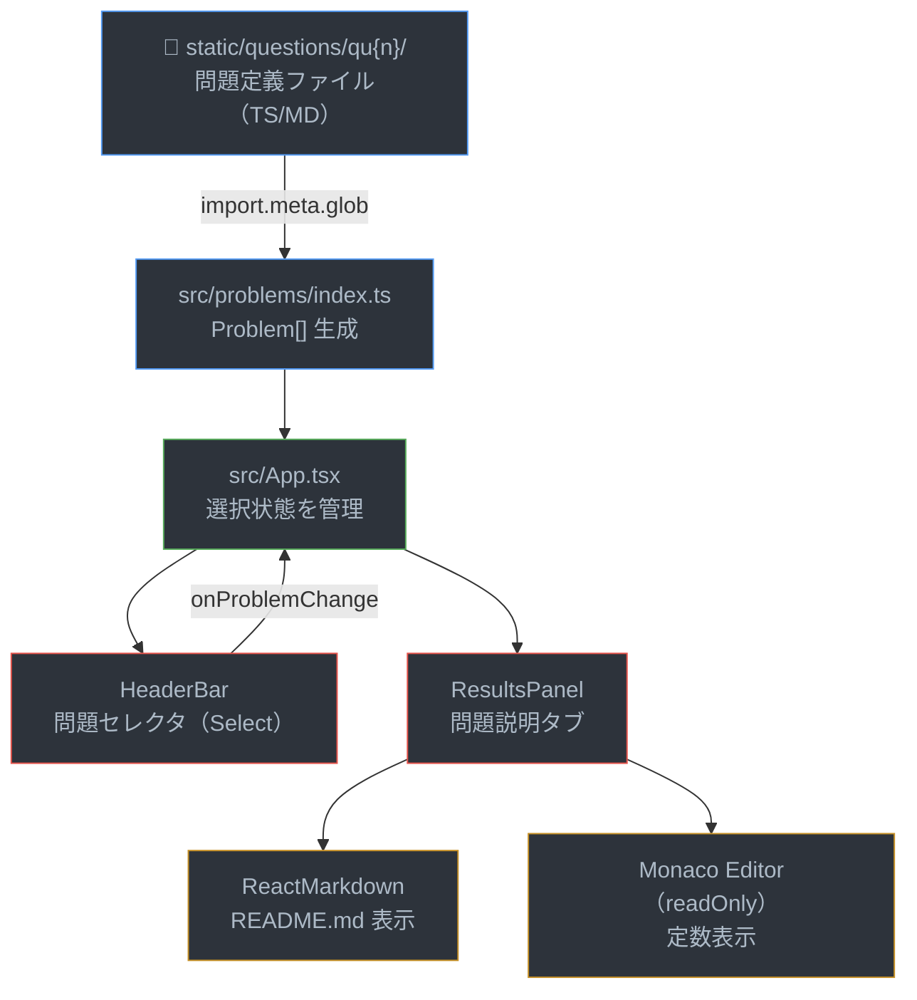
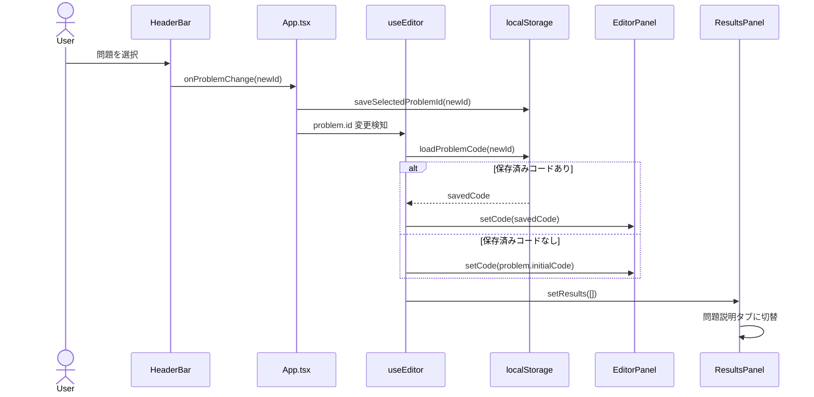

# 機能: 登録されている問題が表示できる

## 概要

`static/questions/qu{n}/` ディレクトリに配置されたTypeScript問題定義ファイル群を、Viteの `import.meta.glob` で自動収集し、ブラウザ上にリスト表示・選択・詳細表示する機能。

---

## データフロー全体図



---

## 1. 問題定義ファイル（static/questions/）

各問題は `static/questions/qu{n}/` ディレクトリに以下のファイルで構成される。

| ファイル | 読み込み方式 | 用途 |
|---------|-------------|------|
| `meta.ts` | eager import（オブジェクト） | id, quId, title, mode, description, functionName |
| `testCases.ts` | eager import（オブジェクト） | TestCase[]（input, expected, name） |
| `execute.ts` | raw import（文字列） | スケルトンコード（初期エディタ内容） |
| `execute.test.ts` | raw import（文字列） | テストコード文字列（Worker内で実行） |
| `README.md` | raw import（文字列） | 問題説明（Markdown） |
| `constants.ts` | raw import（文字列、省略可） | 定数定義（`export` を除去して挿入） |

**型定義 (`src/types/index.ts`):**

```typescript
interface ProblemMeta {
  id: string;       // 問題ID（例: 'pokerHand'）
  quId: string;     // 問題番号（例: '1'）
  title: string;    // 表示タイトル
  mode: 'create' | 'fix';
  description: string;
  functionName: string;
}

interface Problem extends ProblemMeta {
  readme: string;       // README.md の生テキスト
  initialCode: string;  // execute.ts の生テキスト
  testCode: string;     // execute.test.ts の生テキスト
  testCases: TestCase[];
  constants?: string;   // constants.ts の生テキスト（export除去済み）
}
```

---

## 2. 問題収集処理（src/problems/index.ts）

Viteの `import.meta.glob` を6パターン使用し、`static/questions/qu*/` 配下のファイルを一括取得する。

```typescript
const metaModules = import.meta.glob('/static/questions/qu*/meta.ts', { eager: true });
const testCaseModules = import.meta.glob('/static/questions/qu*/testCases.ts', { eager: true });
const readmeModules = import.meta.glob('/static/questions/qu*/README.md', { eager: true, query: '?raw', import: 'default' });
const executeModules = import.meta.glob('/static/questions/qu*/execute.ts', { eager: true, query: '?raw', import: 'default' });
const testCodeModules = import.meta.glob('/static/questions/qu*/execute.test.ts', { eager: true, query: '?raw', import: 'default' });
const constantsModules = import.meta.glob('/static/questions/qu*/constants.ts', { eager: true, query: '?raw', import: 'default' });
```

**処理の流れ:**

1. `metaModules` のキーをソートしてイテレーション
2. ディレクトリパスから `quId`（例: `qu1`）を抽出
3. 各ファイルのモジュールを対応するパスで取得
4. `constants` がある場合、`export` キーワードを正規表現で除去
5. `Problem` オブジェクトを組み立てて配列化
6. `export default problems` で公開

**ポイント:**
- `eager: true` にすることでビルド時に全問題が静的にバンドルされる
- `?raw` クエリで文字列としてインポート（TSコードをそのまま保持）
- ディレクトリ追加だけで自動認識（登録処理不要）

---

## 3. 問題選択UI（HeaderBar + App.tsx）

**App.tsx の状態管理:**

```typescript
const [selectedId, setSelectedId] = useState<string>(
  () => loadSelectedProblemId() ?? problems[0].id
);

const problem = problems.find((p) => p.id === selectedId) ?? problems[0];
```

- 初期値: `localStorage` から復元、なければ最初の問題
- 変更時: `saveSelectedProblemId()` で `localStorage` に永続化

**HeaderBar の問題セレクタ:**

```tsx
<Select value={selectedId} onChange={(e) => onProblemChange(e.target.value)}>
  {problems.map((p) => (
    <MenuItem key={p.id} value={p.id}>
      {p.quId} - {p.title}
    </MenuItem>
  ))}
</Select>
```

---

## 4. 問題説明表示（ResultsPanel）

`ResultsPanel` の Tab 0（「問題説明」タブ）で表示。

```tsx
<MarkdownWrapper>
  <ReactMarkdown>{problem.readme}</ReactMarkdown>
</MarkdownWrapper>
```

- `MarkdownWrapper`: MUI styled Boxで、h1-h3, pre, code, table等のMarkdownスタイルを適用
- 定数がある場合、折りたたみ可能なMonaco Editor（readOnly）で表示

```tsx
{problem.constants && (
  <Editor
    value={problem.constants}
    language="typescript"
    options={{ readOnly: true, minimap: { enabled: false } }}
  />
)}
```

---

## 5. 問題切替時の挙動



`useEditor` hookの `useEffect` で問題ID変更を検知:

```typescript
useEffect(() => {
  const saved = loadProblemCode(problem.id);
  setCodeState(saved ?? problem.initialCode);
  setResults([]);
}, [problem.id]);
```

- 保存済みコードがあればそれを復元、なければスケルトンコードを表示
- テスト結果はリセット
- `ResultsPanel` は問題説明タブ（Tab 0）に自動切替

---

## 関連ファイル

| ファイル | 役割 |
|---------|------|
| `static/questions/qu{n}/*` | 問題定義 |
| `src/problems/index.ts` | 問題収集 |
| `src/types/index.ts` | Problem / ProblemMeta 型 |
| `src/App.tsx` | 選択状態管理 |
| `src/components/Header/HeaderBar.tsx` | 問題セレクタUI |
| `src/components/ResultsPanel/ResultsPanel.tsx` | 問題説明タブ |
| `src/components/MarkdownWrapper/MarkdownWrapper.tsx` | Markdownスタイル |
| `src/services/storage.service.ts` | 選択ID永続化 |
